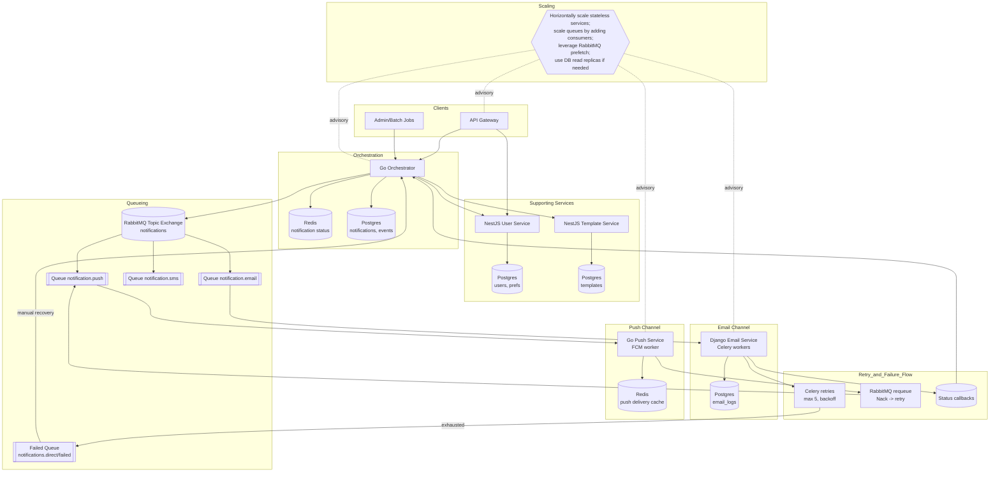

# Notification System Monorepo

This repository hosts a multi-channel notification platform composed of independent services connected through an event-driven pipeline. It orchestrates notification requests, enriches them with user and template data, and delivers them via email and push providers with observability, retries, and dead-letter handling.

## Repository Layout

- `api-gateway/` – NestJS edge service that authenticates clients, rate-limits requests, and proxies to downstream services.
- `services/orchestrator/` – Go service coordinating notification enrichment, persistence, and queue publishing.
- `services/email-service/` – Django + Celery worker that renders templates, sends SMTP mail, logs delivery, and handles retry/dead-letter flows.
- `services/push-service/` – Go worker consuming push messages and dispatching through FCM (APNS placeholder).
- `services/template-service/` – NestJS microservice managing notification templates with Prisma/PostgreSQL.
- `services/user-service/` – NestJS microservice exposing user profile and preference APIs backed by Prisma/PostgreSQL.
- `packages/common/` – Shared TypeScript utilities and DTO definitions.
- `infra/` – Docker Compose stacks for local orchestration of Postgres, Redis, RabbitMQ, and service containers.
- `scripts/` – Database bootstrap scripts.

## Architecture Snapshot

- Orchestrator receives notification requests (via API Gateway or direct clients), persists status in Postgres, and stores quick-look status in Redis.
- RabbitMQ (topic exchange `notifications`) fans out enriched notifications by channel; consumers nack to trigger broker retries.
- Email workers use Celery with exponential backoff, circuit breakers, and dead-letter queue (`failed.queue`) when retries exhaust.
- Push workers manage per-token results, cache delivery summaries in Redis, and are idempotent via message IDs.
- User and Template services expose REST APIs that the orchestrator consults during enrichment.
- Consul (optional) supports service discovery and health checks.

### System Diagram



## Data Stores

- **PostgreSQL** (`infra/docker-compose.yaml`) – Separate logical databases for orchestrator events, template content, user profiles, and channel-specific logs.
- **Redis** – Two DBs: orchestrator status cache and push delivery cache; also used by API rate limiting.
- **RabbitMQ** – Topic exchange with channel-specific queues + DLQ for permanent failures.

## Local Development

1. Install prerequisites:
   - Node.js 20+, pnpm or npm (for NestJS services)
   - Go 1.21+ (for orchestrator, push-service)
   - Python 3.11 + Poetry/pip (for email-service)
   - Docker & Docker Compose
2. Copy environment templates (`*.env.example` where available) and supply credentials for databases, RabbitMQ, Redis, SMTP, and FCM.
3. Start the core infrastructure (Postgres, Redis, RabbitMQ, Consul) and dev services:
   ```bash
   docker compose -f infra/docker-compose.local.yaml up --build
   ```
4. Run individual services in watch/dev mode:
   - API Gateway / Template / User services: `cd api-gateway` or service folder, then `npm install && npm run start:dev`.
   - Orchestrator: `cd services/orchestrator && go run cmd/orchestrator/main.go`.
   - Email service: `cd services/email-service && pip install -r requirements.txt && python manage.py runserver`.
   - Celery worker: `celery -A email_service worker -l info`.
   - Push service: `cd services/push-service && go run cmd/push-service/main.go`.

## Testing & Quality

- TypeScript services use Jest and ESLint (`npm run test`, `npm run lint`).
- Go services rely on `go test ./...` and gofmt/go vet.
- Django email service uses Django test runner (`python manage.py test notifications`).

## Deployment & Scaling Notes

- Stateless services (API Gateway, Orchestrator, Email workers, Push workers) can be replicated behind a load balancer; RabbitMQ fair dispatch + Celery concurrency support horizontal scaling.
- Postgres instances should use managed backups and optional read replicas for analytics.
- Redis should be deployed in a password-protected, highly available mode (e.g., Redis Sentinel).
- Dead-letter queues feed operational dashboards for manual remediation and replay tooling.

## Additional Documentation

- Service-specific READMEs under each service directory.
- Infrastructure manifests under `infra/`.
- SQL bootstrap scripts under `scripts/init-databases.sql`.
